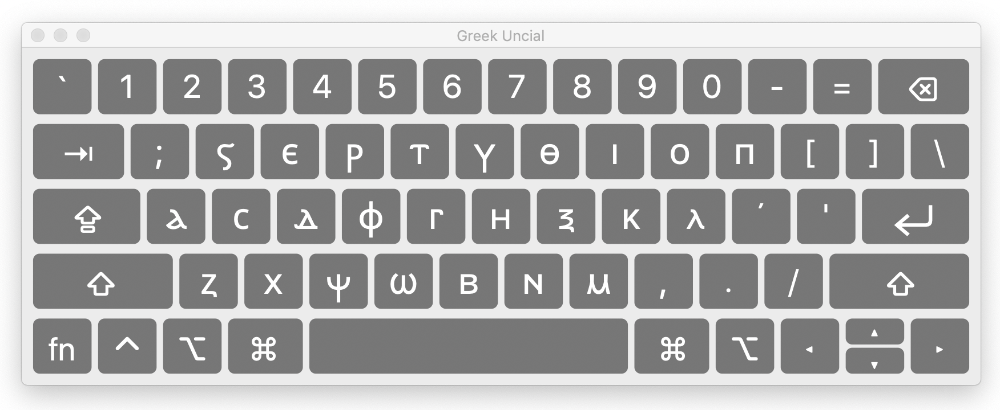

# Uncial Greek Input Method
Unicode input method for typing in Uncial Greek on Mac

# Key Mapping
The key mapping for the input method matches the standard Greek keyboard layout but uses uncial script characters from the Coptic Unicode block.

# Fonts
Google's Noto Sans Coptic is a good place to start:
https://www.google.com/get/noto/#sans-copt

# Mac
- Move "Uncial Greek.keylayout" and "Uncial Greek.icns" into "/Library/Keyboard Layouts"
- Open "System Preferences" -> "Keyboard" -> "Input Sources"
- Click the "+" to add a new input method and under "Others" choose "Uncial Greek"
